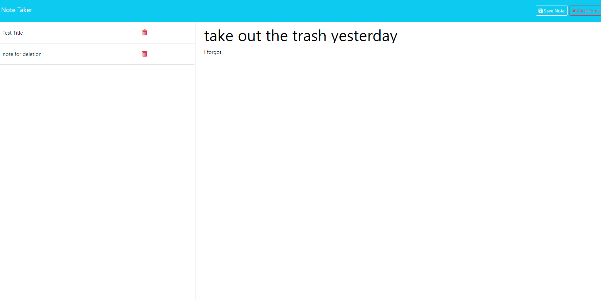

# Notetaker

## Description
- This is a notetaking app that will help you write and save notes. This application uses express and writes/saves data from a JSON file

## Installation
- make sure to npm i and download all the dependencies then start the server locally using npm start

## Usage

## License
-This Project is under the MIT license

## Contribution
- Contributions are closed to the Public

## future development plants
- Going to add a delete notes feature, this feature may be out by the time this app goes public 